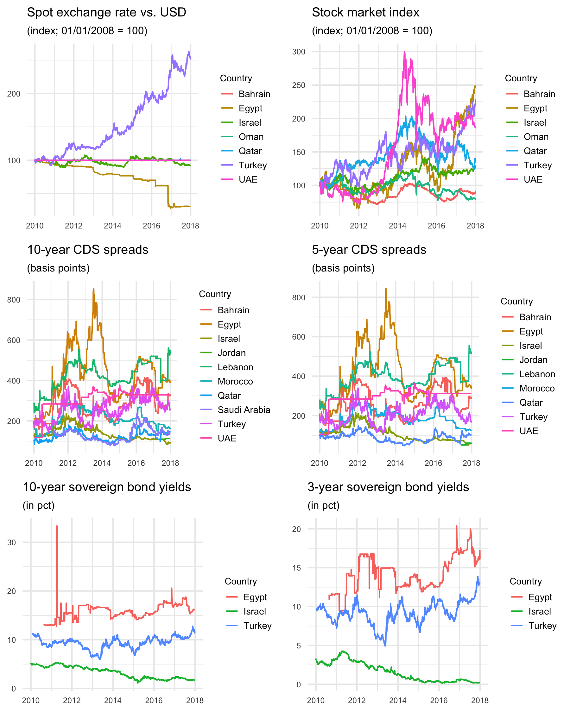
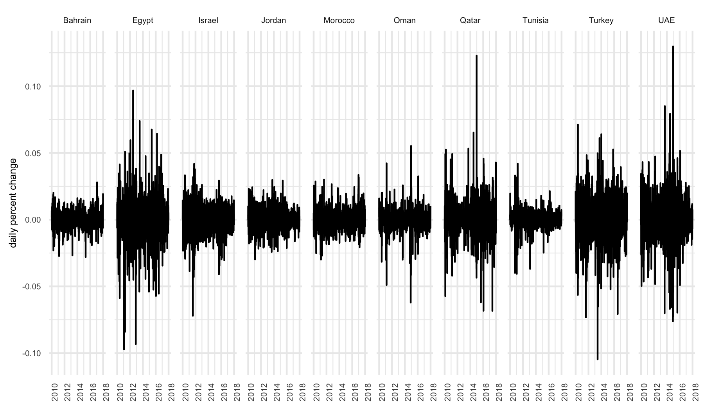
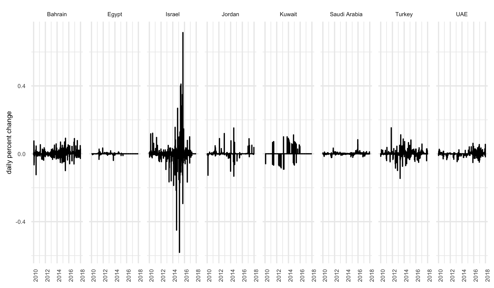
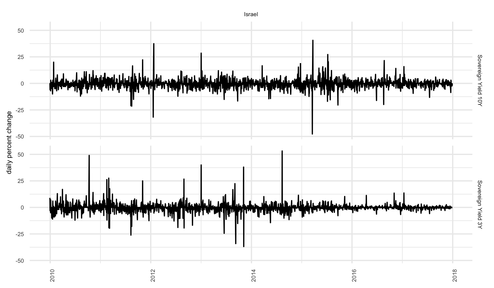
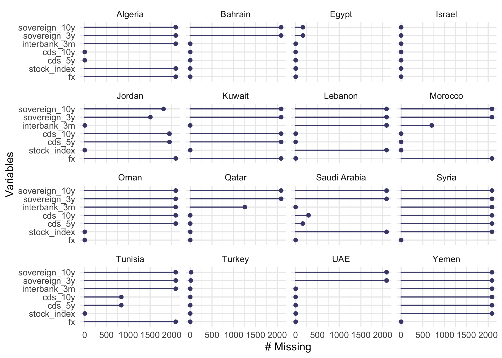
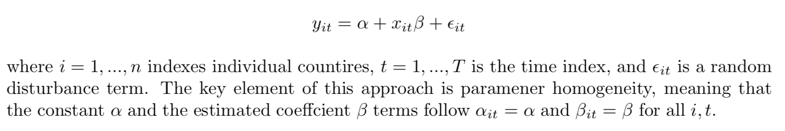
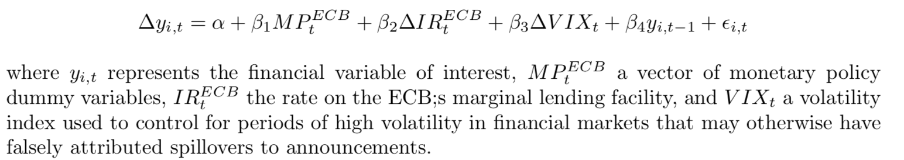
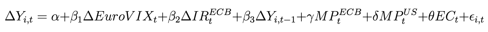

# Monetary Policy Research

The focus of my academic research is on unconventional monetary
policies. This repository contains my research on the spillover effects
of the ECB’s unconventional monetary policies on Central and Eastern
Europe (CEE) as well as the Middle East and North Africa (MENA).

My research with Theocharis Grigoriadis on the spillovers to the CEE
region was recently published in [Comparative Economic
Studies](https://doi.org/10.1057/s41294-020-00114-3).

## Unconventional Monetary Policy Spillover Effects

Since the Global Financial Crisis and the development of unconventional
monetary measures, spillover effects from monetary policies in large
advanced economies to emerging market economies (EME) have become the
subject of considerable debate and a focal point of criticism from
policy makers in EMEs. But how are such spillover effects transmitted
from one economy to another? And, what consequences do they have for
foreign economies? This research investigates the international
transmission of the European Central Bank’s (ECB) unconventional
monetary policies and their spillover effects to Central and Eastern
Europe (CEE) and the Middle East and North Africa (MENA).

## Middle East and North Africa

Using a simple pooled OLS panel regression model with dummy variables
corresponding to ECB monetary policy announcements, this paper seeks to
identify spillover effects to a series of financial variables in Middle
East and North African (MENA) countries over the period 2008-01-03 to
2017-12-29.

Countries of interest: Algeria, Bahrain, Egypt, Iraq, Israel, Jordan,
Kuwait, Lebanon, Morocco, Oman, Qatar, Saudi Arabia, Syria, Tunisia,
Turkey, United Arab Emirates, Yemen

Financial variables of interest:

  - Foreign Exchange Rates
  - Stock Market Indices
  - Interbank lending rates (3 months)
  - Credit Default Swaps (5 year and 10 year maturities)

ECB Monetary Policy Programs:

  - Liquidity providing
    
      - long-term refinancing operations (LTRO)
    
      - targeted longer-term refinancing operations (TLTRO)

  - Asset Purchases
    
      - covered bond purchase program (CBPP1, CBPP2, CBPP3)
    
      - securities markets program (SMP)
    
      - outright monetary transactions (OMT)
    
      - public sector purchase program (PSPP)

### Data

<!--

    

-->

#### Missingness

The largest challenge in conducting this analysis is data availability.
The use of monetary policy announcement dummy variables on a 1-day
window requires daily data for all financial variables of interest. For
many countries, only a subset of the financial variables of interest are
fully available for the full sample period (2008-01-03 to 2017-12-29).
The following chart shows the “missingness” of each variable across all
MENA countries.In order to maintain fully balanced panel data samples,
only series with no missing values on the sample period were selected
for the regressions.

#### Linear Panel Model

The general form of a pooled OLS model can be described through the
following specification:

## Central and Eastern Europe

The following country-specific regression was estimated using daily data
over the period 02.01.2009 – 31.12.2017 for 11 CEE countries:

 <!--
$$\Delta Y_{i,t} = \alpha + \beta_1 \Delta EuroVIX_t + \beta_2 \Delta IR^{ECB}_t + \beta_3 \Delta Y_{i,t-1} + \gamma MP^{ECB}_t +\delta MP^{US}_t + \theta EC_t + \epsilon_{i,t}$$
--> where Y takes on the values of exchange rate vis-à-vis the euro,
stock market index, 3-month interbank lending rate, 3- and 10-year
sovereign bond yields as well as 5- and 10-year credit default swap
spreads. The euro area volatility index is included as EuroVIX to
control for periods of high volatility which may have impacted financial
markets in REE economies. IR represents the interest rate on the ECB’s
marginal lending facility. MP contains the dummy related to the ECB’s
and Federal Reserve’s unconventional monetary policy announcements,
respectively. EC contains dummy variables for the European Commision’s
fiscal policy programs.

Countries of interest: Bulgaria, Croatia, Czechia, Hungary, Latvia,
Poland, Romania, Russia, Serbia.
